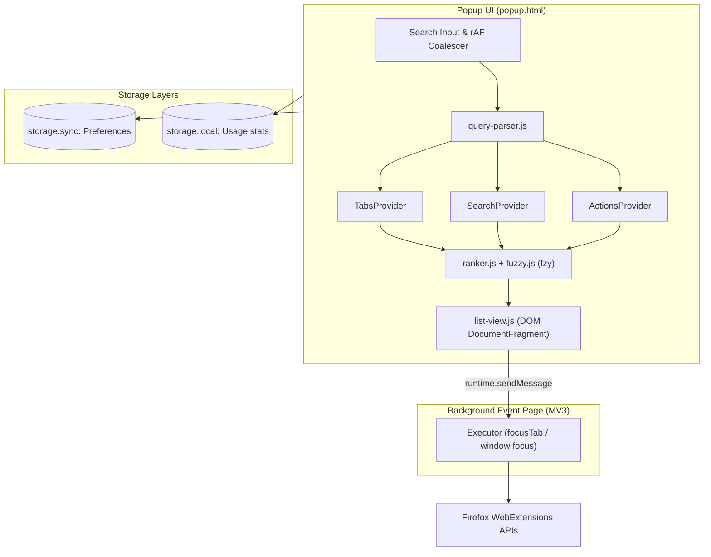

# Konsult (こん 🦊) — Firefox Keyboard Launcher

> *Fast, keyboard-driven Spotlight and PowerToys Run style quick launcher for Mozilla Firefox.*  
> **"Kon" (こん)** — the Japanese onomatopoeia for a fox's cry, and a playful pun on **"consult"** (consulting your browser instantly).

---

## 🌟 Overview

**Konsult** gives Firefox users an instant, unified launcher summoned by a single global browser shortcut (`Ctrl+Shift+Space`). With zero compile-step overhead, zero external network calls, and zero telemetry, Konsult lets you switch tabs across windows, launch searches with your default search engine, and execute browser commands with sub-millisecond latency.

```
+-------------------------------------------------------------------------+
|  🔍  Type a query, tab title, or '@' for actions...            [ACTIONS]|
+-------------------------------------------------------------------------+
|  ⚡  @newtab — Open a fresh blank tab                                   |
|  🦊  Mozilla Firefox Documentation — developer.mozilla.org      [Win 1] |
|  💻  GitHub: Where the world builds software — github.com      [Pinned] |
|  🔎  Search DuckDuckGo for "rust async stream"                [Search] |
+-------------------------------------------------------------------------+
|  ↑↓ navigate  ·  ↵ select  ·  ⇧↵ web search  ·  esc close               |
+-------------------------------------------------------------------------+
```

---

## ✨ Key Features

### 1. 🔍 Default Search Engine Integration
- **Never Hardcoded:** Konsult automatically queries Firefox's `browser.search.get()` API to detect your active default search engine (DuckDuckGo, Google, Bing, Ecosia, Qwant, etc.) and uses its native icon and label.
- **Synchronous User-Gesture Dispatch:** Searches execute cleanly via `browser.search.search({ disposition: "NEW_TAB" })` without losing user-action privileges.
- **Smart Promotion:** If your query doesn't strongly match open tabs (`score < 0.35`), the search row automatically floats to the top for instant search on `Enter`.
- **Direct URL Detection:** Typing domain names (e.g. `github.com/mozilla` or `localhost:8080`) gives an instant option to navigate directly.

### 2. 📑 Blazing-Fast Tab Switcher
- **Multi-Window Navigation:** Lists and indexes all open tabs across every Firefox window in memory. Selecting a tab focuses both the target window and the active tab via a dedicated background event executor.
- **State Badges:** Visual indicators for **Pinned**, **Audio Playing**, **Muted**, and **Sleeping (Discarded)** tabs.
- **Context Isolation:** Respects Firefox Private Browsing. By default, normal windows only show normal tabs, and private windows only show private tabs.
- **Custom Sorting & Grouping:**
  - **Native Order:** By window index and tab sequence (current window tabs pinned to top).
  - **Alphabetical:** Natural alphanumeric title sorting via `Intl.Collator`.
  - **Domain Grouping:** Visual headers clustering tabs under common hostnames (e.g. `github.com`, `reddit.com`), with automatic keyboard skip over headers.

### 3. ⚡ Quick `@action` Commands
Type `@` to access instant browser controls:
- `@newtab` (`Ctrl+T`): Open a fresh blank tab.
- `@window` (`Ctrl+N`): Open a new standard window.
- `@private` (`Ctrl+Shift+P`): Open a private browsing window.
- `@reload` / `@hardreload`: Reload current tab (with or without cache bypass).
- `@duplicate`: Clone the active tab in place.
- `@pin`: Toggle pinned state on active tab.
- `@mute`: Toggle audio mute state.
- `@close` (`Ctrl+W`): Close the active tab.
- `@reader` (`Ctrl+Alt+R`): Toggle Firefox Reader Mode.
- `@options`: Open Konsult Settings.
- **Honest Fallbacks for Privileged URLs:** Firefox WebExtensions strictly prohibit extensions from navigating directly to internal chrome pages like `about:addons`, `about:preferences`, and `about:config`. Rather than failing silently, Konsult provides one-click copy to clipboard with native keyboard shortcut reminders.

---

## ⌨️ Keyboard Shortcuts & Modifiers

| Shortcut | Description |
|---|---|
| `Ctrl+Shift+Space` | Summon / Focus Konsult from any tab (including `about:` pages and PDFs) |
| `↑` / `↓` or `Ctrl+P` / `Ctrl+N` | Move selection up and down the result list |
| `PageUp` / `PageDown` | Move selection by 5 items |
| `Enter` | Execute top-ranked item (switch tab, run action, or search) |
| `Shift+Enter` | **Force Web Search:** Bypasses tab matches and searches your query |
| `Ctrl+Enter` | Open web search in a background tab without stealing focus |
| `Tab` | Autocomplete selected `@action` name into search input |
| `Escape` | 1st press: Clear search text; 2nd press: Dismiss launcher popup |

### Query Prefix Modes

| Prefix | Mode | Example | Description |
|---|---|---|---|
| `@` | **Actions** | `@pin`, `@reload` | Filters browser commands and shortcuts |
| `%` | **Tabs** | `% rust docs` | Constrains query strictly to open tabs |
| `*` | **Bookmarks** | `* react` | Bookmarks search mode (Roadmap M4) |

---

## 🏗️ Architecture & Technical Design

Konsult is engineered for minimal resource consumption, extreme speed, and strict adherence to Mozilla Add-ons (AMO) security standards:



### Key Technical Decisions:
1. **Manifest V3 Event Page:** Background script (`src/background/main.js`) unloads when idle and wakes only to handle multi-step window/tab focus sequences.
2. **Zero-Build Plain ES Modules:** Uses native modern browser ES Modules with JSDoc typing (`// @ts-check`). No Webpack/Vite bundle step is needed, meaning instant live reload during development and transparent review for AMO.
3. **Vendored `fzy` Scorer:** Fast dynamic programming matching algorithm (~150 LOC) calculating substring alignment, word boundary bonuses, and character positions for visual search highlighting.
4. **Pure DOM Manipulation:** Eliminates all `innerHTML` assignments in favor of `DocumentFragment` and SVG namespace element factories, completely resolving AMO automated security flags.
5. **Private Window Protection:** Usage statistics are never recorded during private browsing sessions.

---

## 🚀 Getting Started & Development

### Prerequisites
- [Node.js](https://nodejs.org/) (v18+)
- [Mozilla Firefox](https://www.mozilla.org/firefox/) (v142.0+ recommended; tested on Firefox 157)

### Installation
Clone the repository and install dev dependencies:
```bash
git clone https://github.com/your-username/FireFox-SpotLight.git
cd FireFox-SpotLight
npm install
```

### Run Locally (Live Reload)
Launch Firefox with Konsult loaded as a temporary extension:
```bash
npm start
```
*Note: Any edits saved to `src/` will trigger an instant reload in the running Firefox instance.*

### Run Automated Tests
Execute the pure unit test suite:
```bash
npm test
```
Tests cover:
- `fzy` dynamic programming scorer and consecutive match bonuses
- Substring highlighting and positions calculation
- Multi-token `AND` conjunction across weighted fields (title, hostname, URL)
- Query prefix parser (`@`, `%`, `*`)
- URL detection and normalization
- Settings deep-merge and ranking formula

### Run WebExtensions Linter
Validate Manifest V3 permissions and security rules against Mozilla AMO standards:
```bash
npm run lint
```
*Output: 0 errors, 0 warnings, 0 notices.*

---

## ⚙️ Configuration & Settings

Access settings via **Konsult Launcher Footer > Settings Icon** or navigate to `about:addons` > **Konsult** > **Options**:

- **Tabs & Switcher:**
  - *Sort Mode:* Native Firefox order vs. Alphabetical (`Intl.Collator`).
  - *Current Window First:* Float tabs from the focused window to the top.
  - *Group by Domain:* Cluster open tabs under visual website domain headers.
  - *Empty Query Order:* Display tabs in default sort order or Most Recently Used (MRU).
  - *Show Pinned / Discarded:* Toggle visibility of pinned and sleeping tabs.
- **Search & Navigation:**
  - *Enter Key Behavior:* Best match (`topResult`) vs Always Web Search (`alwaysSearch`).
  - *Detect Direct URLs:* Automatic navigation option for domain-like inputs.
- **Appearance & Limits:**
  - *Max Results:* Limit rendered items (default: 50).
- **Developer Tools & M0 Probe:**
  - Built-in live testing suite verifying `about:*` URLs against `browser.tabs.create()`.

---

## 🔒 Privacy & Permissions

Konsult is strictly local and private:
- ❌ **No Telemetry or Analytics.**
- ❌ **No External Network Calls:** Zero fetch/XHR requests to third-party servers.
- ❌ **No Eval or Remote Scripts.**
- ✅ **Minimal Permissions:**
  - `"tabs"`: Required to read tab titles, URLs, and favicons to display them in the launcher.
  - `"search"`: Required to detect the user's default engine and dispatch search queries.
  - `"storage"`: Required to sync user preferences across devices.

---

## 🗺️ Roadmap & Milestones

- [x] **M0: Spike & Scaffolding** — MV3 manifest, icons, background event executor, clean AMO lint.
- [x] **M1: MVP Search & Tab Switcher** — Default search engine integration, fuzzy tab search, domain grouping, multi-window focus, keyboard navigation.
- [x] **M2: Quick Actions** — Full `@action` registry with honest fallbacks for privileged pages.
- [ ] **M3: Quick Wins (v1.x)** — In-list tab closing/pinning/muting buttons, `@md` copy markdown link, recently closed sessions.
- [ ] **M4: Advanced (v2.0)** — Bookmarks search (`*`), duplicate tab cleanup, suspend unused tabs, native Firefox Tab Groups (`tabGroups` API).

---

## 📄 License

Distributed under the [MIT License](LICENSE).  
Fuzzy scoring algorithm based on [fzy](https://github.com/jhawthorn/fzy) by John Hawthorn (MIT License).
