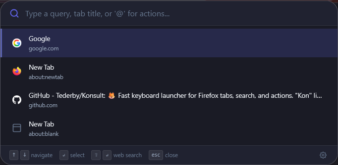
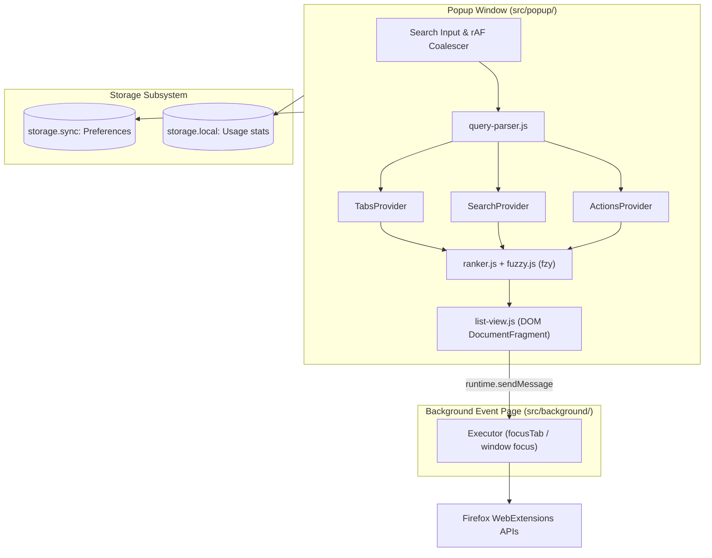

<div align="center">
  
  <h1>Konsult</h1>
  <p>A keyboard-first, low-latency Spotlight and PowerToys Run style launcher for Mozilla Firefox.</p>

  <p>
    <a href="https://www.mozilla.org/firefox/"></a>
    <a href="https://extensionworkshop.com/documentation/develop/manifest-v3-migration-guide/"></a>
    <a href="#"></a>
    <a href="#"></a>
    <a href="LICENSE"></a>
    <a href="#"></a>
    <a href="#"></a>
  </p>
</div>

---

## Table of Contents

- [Overview](#overview)
- [Features](#features)
- [Keybindings & Controls](#keybindings--controls)
- [Query Syntax](#query-syntax)
- [Quick Start](#quick-start)
- [Architecture & Design](#architecture--design)
- [Settings & Configuration](#settings--configuration)
- [Privacy & Security](#privacy--security)
- [Development & Testing](#development--testing)
- [Roadmap](#roadmap)
- [License](#license)

---

## Overview

**Konsult** (*"Kon"* — the Japanese onomatopoeia for a fox's call, and a pun on *consult*) is a fast, keyboard-driven navigation overlay for Firefox.

Summoned by `Ctrl+Shift+Space`, Konsult runs directly inside Firefox chrome as a browser action popup. It works on every tab—including internal `about:*` pages, PDF viewers, and Mozilla-restricted domains—with zero external network calls, zero tracking, and sub-millisecond in-memory fuzzy search.



---

## Features

### Default Search Engine Integration
- **Zero hardcoding:** Automatically queries `browser.search.get()` to resolve the user's active default engine (DuckDuckGo, Google, Bing, Ecosia, etc.) along with its native icon and title.
- **Synchronous dispatch:** Dispatches searches via `browser.search.search({ disposition: "NEW_TAB" })` directly within the keydown gesture handler to adhere to Firefox user-action policies.
- **Smart promotion:** Automatically promotes the search row to position `#1` when fuzzy tab matching falls below threshold (`0.35`).
- **Direct URL detection:** Automatically suggests direct navigation when the query resembles a domain or URL (e.g. `github.com/mozilla` or `localhost:8080`).

### High-Performance Tab Switcher
- **Cross-window indexing:** Indexes and caches open tabs across all browser windows upon popup invocation.
- **Multi-step focus executor:** Delegates window and tab focusing to a background event page (`windows.update` then `tabs.update`) to prevent race conditions during popup destruction.
- **Tab state badges:** Visual badges for **Pinned**, **Audio Playing**, **Muted**, and **Sleeping (Discarded)** tabs.
- **Context isolation:** Strict separation between normal and private windows. Private tabs are never surfaced in regular browsing sessions by default.
- **Custom sorting & grouping:**
  - *Native Order:* Window sequence with current window pinned to top.
  - *Alphabetical:* Natural alphanumeric collation via `Intl.Collator`.
  - *Domain Grouping:* Visual clustering by hostname with automatic keyboard navigation skipping group headers.

### Quick Actions (`@`)
- Access internal browser controls:
  - `@newtab` (`Ctrl+T`): Open a fresh blank tab.
  - `@window` (`Ctrl+N`): Open a new standard window.
  - `@private` (`Ctrl+Shift+P`): Open a private browsing window.
  - `@reload` / `@hardreload`: Reload current tab (with or without cache bypass).
  - `@duplicate`: Duplicate active tab.
  - `@pin`: Toggle pinned state.
  - `@mute`: Toggle audio mute state.
  - `@close` (`Ctrl+W`): Close active tab.
  - `@reader` (`Ctrl+Alt+R`): Toggle Firefox Reader Mode.
  - `@options`: Open Konsult preferences.
- **Honest fallback for privileged URLs:** Firefox security policy prohibits extensions from opening pages like `about:addons` and `about:config` via `tabs.create()`. Konsult displays these actions with one-click clipboard copying and native shortcut guidance instead of failing silently.

---

## Keybindings & Controls

| Keybinding | Scope | Action |
|---|---|---|
| `Ctrl+Shift+Space` | Global Browser | Summon or focus Konsult popup |
| `Down` / `Ctrl+N` | Popup | Move selection down |
| `Up` / `Ctrl+P` | Popup | Move selection up |
| `PageDown` / `PageUp` | Popup | Jump selection by 5 rows |
| `Enter` | Popup | Execute highlighted row (switch tab, run action, or search) |
| `Shift+Enter` | Popup | **Force Web Search:** Executes search query regardless of tab match |
| `Ctrl+Enter` | Popup | Open web search in a background tab |
| `Tab` | Popup | Autocomplete selected `@action` identifier |
| `Escape` | Popup | First press: clears input; Second press: closes popup |

---

## Query Syntax

Konsult supports dedicated prefix modes inspired by the Firefox address bar:

| Prefix | Mode | Example | Behavior |
|---|---|---|---|
| `@` | Actions | `@reload` | Filters registered commands and shortcuts |
| `%` | Tabs | `% github pr` | Constrains matching strictly to open tabs |
| `*` | Bookmarks | `* react` | Bookmarks search mode (planned in roadmap) |
| *(none)* | All | `rust docs` | Unified ranked search across tabs, actions, and web search |

---

## Quick Start

### Prerequisites
- [Node.js](https://nodejs.org/) (v18.0.0+)
- [Mozilla Firefox](https://www.mozilla.org/firefox/) (v142.0+ recommended; verified on Firefox 157)

### Installation
Clone the repository:
```bash
git clone https://github.com/Tederby/Konsult.git
cd Konsult
npm install
```

### Launch in Development Mode
Start an isolated Firefox instance with Konsult pre-installed and auto-reloading:
```bash
npm start
```

Press `Ctrl+Shift+Space` in the newly opened Firefox window to summon the launcher.

---

## Architecture & Design

Konsult is built without compilation tools, bundling steps, or external dependencies.



### Technical Highlights
1. **Manifest V3 Event Page:** Background script (`src/background/main.js`) remains dormant and unloads when idle, waking only to coordinate multi-step window/tab focus sequences.
2. **Vendored `fzy` Scorer:** Port of John Hawthorn's dynamic programming fuzzy matching algorithm (`src/vendor/fzy.js`), returning character match indices used for real-time visual text highlighting.
3. **Pure DOM Generation:** Eliminates all assignments to `innerHTML`. All elements and SVGs are created via `document.createElement`, `document.createTextNode`, and `document.createElementNS`, guaranteeing zero AMO linter warnings.
4. **Multi-token Conjunction:** Queries separated by whitespace enforce strict `AND` matching across title, hostname, and full URL fields.

Detailed architecture and data flows are documented in [docs/ARCHITECTURE.md](docs/ARCHITECTURE.md).

---

## Settings & Configuration

Configure preferences via **Konsult Launcher Footer > Settings Icon** or `about:addons` > **Konsult** > **Options**:

- **Tabs & Switcher:**
  - *Sort Mode:* Native tab order vs. Alphabetical (`Intl.Collator`).
  - *Current Window First:* Keep tabs from the focused window at the top.
  - *Group by Domain:* Visually cluster tabs under website domain headers.
  - *Empty Query Order:* Default sort order vs. Most Recently Used (MRU).
  - *Show Pinned / Discarded:* Toggle visibility of pinned and sleeping tabs.
- **Search & Navigation:**
  - *Enter Key Behavior:* Top result vs. Always Web Search.
  - *Detect Direct URLs:* Enable direct navigation for domain-like queries.
- **Developer Tools & M0 Probe:**
  - Includes an empirical test suite that verifies `tabs.create()` permissions against internal `about:*` URLs. (See [docs/about-matrix.md](docs/about-matrix.md)).

---

## Privacy & Security

- **Local Computation:** All fuzzy matching, tokenization, and tab indexing occur strictly in memory.
- **Zero Telemetry:** No analytics, tracking pixels, or remote telemetry scripts.
- **Zero Outbound Network Calls:** No background HTTP requests or remote code execution.
- **Private Browsing Isolation:** Incognito usage is never recorded to `storage.local`.
- **Permissions Justification:**
  - `"tabs"`: Required to read tab titles, URLs, and favicons.
  - `"search"`: Required to detect the default engine and dispatch search queries.
  - `"storage"`: Required to persist configuration in `storage.sync`.

---

## Development & Testing

### Unit Tests
Run the standalone unit test suite via Node.js test runner:
```bash
npm test
```

### Linter
Validate Manifest V3 permissions and code compliance with official Mozilla standards:
```bash
npm run lint
```
*Current status: 0 errors, 0 warnings, 0 notices.*

### Manual Test Checklist
For complete verification scenarios (multi-window, audio indicators, search engine switching), refer to [tests/manual/checklist.md](tests/manual/checklist.md).

---

## Roadmap

- [x] **Milestone 0: Scaffolding & Spikes** — MV3 manifest, icons, background event executor, clean linter.
- [x] **Milestone 1: Web Search & Tab Switcher** — Default search engine prefetch, fuzzy tab filtering, domain grouping, keyboard nav.
- [x] **Milestone 2: Command Actions** — `@` action framework with honest fallbacks for privileged pages.
- [ ] **Milestone 3: Tab Row Actions** — In-list mute, pin, close buttons, and recently closed session restore (`sessions` API).
- [ ] **Milestone 4: Extended Providers** — Bookmarks search (`*`), duplicate tab deduplication, native Firefox Tab Groups (`tabGroups` API).

For detailed feature proposals, ideas backlog, and user experience concepts, see [docs/IDEAS.md](docs/IDEAS.md).

---

## License

This project is licensed under the [MIT License](LICENSE).  
The fuzzy scoring algorithm is adapted from [fzy](https://github.com/jhawthorn/fzy) by John Hawthorn (MIT License).
