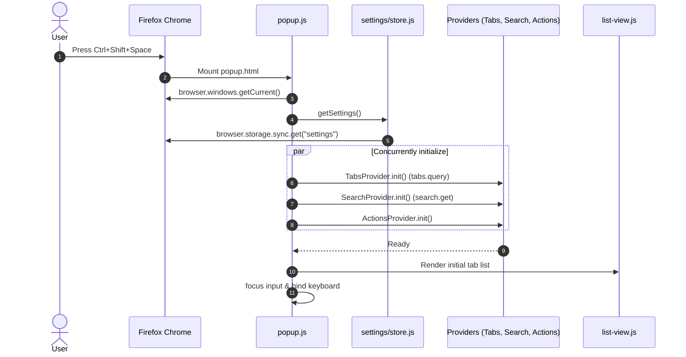

# Konsult — Architectural Blueprint & Technical Specification

> **Document Version:** 1.0.0  
> **Target Platform:** Mozilla Firefox (Manifest V3, ESR 142.0+ & Rapid Release)  
> **Technology Stack:** Pure Vanilla JavaScript (ES2022 Modules), JSDoc, CSS3 Glassmorphism, WebExtensions API.

---

## 1. System Overview & Design Philosophy

**Konsult** is designed as a minimalist, high-performance launcher operating entirely inside the browser's native chrome layer. Unlike content-script overlays that inject DOM into web pages (which fail on `about:*` pages, PDF viewers, and Mozilla restricted domains), Konsult uses an extension browser action popup (`_execute_action`). This guarantees universal accessibility across every tab.

### Core Architectural Pillars
1. **Zero Runtime Dependencies:** No external runtime libraries, UI frameworks, or bundled node polyfills. All code runs as native ES modules.
2. **Synchronous Query Pipeline:** Keystroke scoring is executed synchronously over pre-indexed tab haystacks, achieving input-to-render latency under 16ms (60fps budget).
3. **Stateless Background Event Page:** Aligned with Firefox MV3 best practices; the background script is ephemeral and acts purely as an executor for multi-step window focus actions.
4. **Honest Platform Boundaries:** Adheres strictly to Firefox WebExtensions security policies without attempting privileged workarounds that break AMO compliance.

---

## 2. Component Structure & Directory Layout

```
FireFox-SpotLight/
├── manifest.json                  # WebExtensions MV3 manifest
├── package.json                   # Project metadata, lint, and test scripts
├── README.md                      # Public documentation and overview
├── _locales/                      # Internationalization
│   ├── en/messages.json           # English strings
│   └── id/messages.json           # Indonesian strings
├── icons/                         # Extension icons (16, 32, 48, 96, 128px PNG)
├── docs/                          # Architectural & security documentation
│   ├── ARCHITECTURE.md            # This specification
│   ├── IMPLEMENTATION_PLAN.md     # Active development roadmap & decisions log
│   └── about-matrix.md            # Firefox about:* restriction matrix
├── src/
│   ├── background/
│   │   └── main.js                # Event page, install hooks, focus executor
│   ├── popup/                     # Primary Launcher UI
│   │   ├── popup.html             # Shell and semantic combobox structure
│   │   ├── popup.css              # Glassmorphic responsive styling
│   │   ├── popup.js               # Event loop coordinator & rAF scheduler
│   │   ├── list-view.js           # Safe DOM rendering via DocumentFragment
│   │   └── keyboard.js            # Keybindings & modifier handling
│   ├── options/                   # Preferences & Developer Tools
│   │   ├── options.html           # Settings interface & probe runner
│   │   ├── options.css            # Settings styling
│   │   └── options.js             # Form bindings & storage sync
│   ├── core/                      # Pure, DOM-free Business Logic (Unit-Tested)
│   │   ├── fuzzy.js               # Score normalization & multi-token matcher
│   │   ├── ranker.js              # Combined scoring, search promotion, domain grouper
│   │   ├── ranking-config.js      # Tuning constants, weights, and halflife decay
│   │   ├── query-parser.js        # Lexer for @, %, * sigils and tokens
│   │   └── url-utils.js           # Hostname parsing and URL heuristics
│   ├── providers/                 # Data Source Providers
│   │   ├── base.js                # BaseProvider abstract interface
│   │   ├── tabs.js                # Open tabs indexer, search, and sorter
│   │   ├── search.js              # Default engine detector & search dispatcher
│   │   └── actions.js             # Command suite provider
│   ├── actions/                   # Command Registry
│   │   └── registry.js            # Builtin actions & honest fallback definitions
│   ├── settings/                  # Configuration Store
│   │   ├── schema.js              # Schema definitions and default values
│   │   └── store.js               # deepMerge utility and storage.sync manager
│   └── vendor/
│       ├── fzy.js                 # John Hawthorn's fzy scoring algorithm (MIT)
│       └── LICENSE-fzy            # Upstream fzy license
├── tests/
│   ├── unit/                      # Node.js built-in runner tests (node --test)
│   │   ├── fuzzy.test.js
│   │   ├── query-parser.test.js
│   │   ├── ranker.test.js
│   │   ├── settings.test.js
│   │   └── url-utils.test.js
│   └── manual/
│       └── checklist.md           # Step-by-step interactive test protocol
└── tools/
    ├── generate-icons.js          # Pure Node.js PNG icon generator
    └── probe-about-urls.js        # Empirical test probe for tabs.create()
```

---

## 3. Data Flow & Lifecycles

### 3.1 Cold Start & Initialization Sequence
When the user presses `Ctrl+Shift+Space`:
1. **Popup Mounting:** Firefox creates the popup DOM document (`popup.html`).
2. **Context Gathering:** `popup.js` queries `browser.windows.getCurrent()` to determine the current `windowId` and whether the session is `incognito`.
3. **Settings Retrieval:** Concurrently reads `settings` from `browser.storage.sync` with a transparent fallback to `DEFAULT_SETTINGS` if unconfigured.
4. **Provider Pre-Warming:**
   - `TabsProvider.init()` executes `browser.tabs.query({})`, strips tabs restricted by private-window rules, lowercases haystacks, and caches the tab list in memory.
   - `SearchProvider.init()` queries `browser.search.get()` to locate the search engine flagged `isDefault: true`, extracting its name and favicon.
   - `ActionsProvider.init()` loads builtin actions.
5. **Initial Render:** Passes initial candidate tabs (ordered by configured sort mode) to `ListView.render()`.
6. **Autofocus Guarantee:** Invokes `input.focus()` immediately and schedules a secondary check on `requestAnimationFrame` and `document.onvisibilitychange`.



---

### 3.2 Keystroke Query & Ranking Cycle
As the user types:
1. **Event Coalescing:** The `input` event listener stores the raw input and cancels any pending `requestAnimationFrame` tick. This guarantees at most one query execution per browser render frame (16.6ms).
2. **Query Parsing (`query-parser.js`):**
   - Strips leading whitespace.
   - Detects mode prefix: `@` sets `mode: "actions"`, `%` sets `mode: "tabs"`, `*` sets `mode: "bookmarks"`.
   - Splits remaining query text into whitespace-delimited tokens.
3. **Provider Querying:**
   - Dispatches `query(parsed, ctx)` to all active providers in parallel.
   - For `TabsProvider`: Iterates over cached tabs. Every token in the query must match at least one weighted field (`title`, `hostname`, `url`) in the tab (strict `AND` conjunction).
4. **Multi-Source Ranking (`ranker.js`):**
   - Calculates the `finalScore` using the unified formula:
     $$\text{FinalScore} = (\text{NormFuzzyScore} \times \text{Weight}_{\text{provider}}) + \text{Bonus}_{\text{recency}} + \text{Bonus}_{\text{window}} + \text{Bonus}_{\text{usage}}$$
     - **Recency Decay:** Half-life of 6 hours calculated from `Tab.lastAccessed`.
     - **Window Affinity:** Tabs belonging to the currently focused window receive a $+0.03$ bonus.
5. **Search Row Promotion:**
   - If the top tab match has $\text{FinalScore} < 0.35$ (the configured `SEARCH_ROW_THRESHOLD`), the web search row is promoted to index $0$.
   - If a strong tab match exists, the search row is appended immediately after high-confidence matches.
6. **Domain Grouping (Optional):**
   - If enabled in settings, tabs sharing a hostname are grouped under presentational headers. The group sequence is sorted by the maximum score of any group member.
7. **DOM Update (`list-view.js`):**
   - Replaces list children via a single `DocumentFragment`.
   - Characters matching the search query are wrapped in `<span class="item-match-highlight">`.
   - Selection index is clamped and scrolled into view.

---

### 3.3 Selection & Execution Cycle
When `Enter` is pressed:
- **Case A: Open Tab Selected:**
  1. `TabsProvider.execute()` sends `{ type: "execute", action: "focusTab", tabId, windowId }` via `browser.runtime.sendMessage`.
  2. The background event page (`main.js`) handles the message:
     ```js
     await browser.windows.update(windowId, { focused: true });
     await browser.tabs.update(tabId, { active: true });
     ```
  3. `window.close()` is called on the popup.
  *Note:* Using the background executor prevents race conditions where the popup document is destroyed by window focus switch before `tabs.update` finishes.

- **Case B: Web Search Selected (or `Shift+Enter` pressed):**
  1. Synchronously inside the keydown listener, `browser.search.search({ query, disposition: "NEW_TAB" })` is dispatched.
  2. `window.close()` dismisses the popup.
  *Note:* Dispatched synchronously before any `await` statement to preserve user-action authorization (MDN User Actions Policy).

- **Case C: Action Command Selected:**
  1. Executes the registered command handler from `BUILTIN_ACTIONS`.
  2. If the action targets a blocked privileged page (`about:addons`, `about:preferences`), copies the URL to the user's clipboard and displays an informative notification.

---

## 4. Security, Privileges & AMO Compliance

### 4.1 Minimal Manifest V3 Permissions
Konsult requests only three non-optional permissions:

| Permission | Justification |
|---|---|
| `"tabs"` | Required to read `tab.url`, `tab.title`, `tab.favIconUrl`, and tab state flags (`pinned`, `audible`, `discarded`). |
| `"search"` | Required to query installed engines via `browser.search.get()` and execute queries via `browser.search.search()`. |
| `"storage"` | Required to persist user settings via `browser.storage.sync` and usage frequencies via `browser.storage.local`. |

Optional permissions (`"sessions"`, `"bookmarks"`, `"downloads"`, `"tabGroups"`) are defined in `optional_permissions` and requested on-demand only when specific features are activated.

### 4.2 Privileged URL Restrictions
Under the Firefox security architecture, `browser.tabs.create()` refuses to open privileged internal URIs:
- `about:config`, `about:addons`, `about:debugging`
- `about:preferences`, `about:downloads`
- `chrome://*`, `javascript:*`, `data:*`, `file:*`

Konsult addresses this with an **Honest Fallback Pattern**:
1. It never pretends to be able to navigate to these URLs directly.
2. It provides clipboard copy with feedback ("Copied to clipboard! Paste into address bar").
3. It displays native Firefox keyboard shortcuts (e.g. `Ctrl+Shift+A` for Add-ons, `Ctrl+,` for Preferences).

### 4.3 Automated Security Checks
- **No `innerHTML`:** All DOM construction in `list-view.js` uses `document.createElement`, `document.createTextNode`, and `document.createElementNS` for SVGs.
- **Data Collection Declaration:** Manifest includes:
  ```json
  "data_collection_permissions": { "required": ["none"] }
  ```
  Required for all new submissions to addons.mozilla.org (AMO) since November 2025.

---

## 5. Performance Benchmarks & Targets

| Metric | Target | Implemented Mechanism |
|---|---|---|
| **Cold Start Latency** | < 100ms | Zero compilation; small asset footprint; async parallel `init()`. |
| **Keystroke-to-Paint** | < 16ms | Synchronous in-memory scoring; `requestAnimationFrame` coalescing. |
| **Tab Scale Capacity** | 1,000+ tabs | Pre-lowercased string haystacks; fast DP pruning in `fzy.js`. |
| **DOM Allocation** | Minimal | Single `DocumentFragment` commit per render; max 50 rows. |
| **Memory Footprint** | Ephemeral | In-memory cache destroyed upon popup close; background unloads when idle. |

---

## 6. Testing Strategy

1. **Unit Testing (`tests/unit/`):**
   - Pure logic verified via Node.js test runner:
     ```bash
     npm test
     ```
   - Covers: Substring matching, word boundary bonuses, highlight offsets, query sigil parsing, URL normalization, ranking formulas, settings deep-merge.
2. **Linter Validation:**
   - Validated against Mozilla's official linter:
     ```bash
     npx web-ext lint
     ```
   - Standard: Zero errors, zero notices, zero warnings.
3. **Manual Test Checklist (`tests/manual/checklist.md`):**
   - Interactive verification across multi-window configurations, audio tabs, sleeping tabs, and private browsing.
