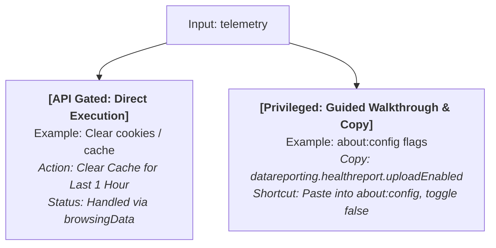

# Konsult — Ideas, Feature Backlog & Product Vision

> **Status:** Living Document & Brainstorming Vault.  
> **Purpose:** Captures the core product vision, user feedback, feature backlog, and technical considerations for the continuous development of Konsult.

---

## 1. Core Vision & Product Value

> **"The ultimate shortcut for users who are lazy or don't know how to configure settings in Firefox (both common and obscure), paired with a high-speed, keyboard-first launcher."**

Many users choose Firefox for its independence, customizability, and robust privacy, but encounter common friction points:
1. **Scattered & Complex Settings:** Configuration options are spread across `about:preferences`, the hamburger menu, nested sub-tabs, and hidden `about:config` flags.
2. **Lack of Instant Guidance:** Users frequently forget specific flag names (e.g., `browser.uidensity` for compact mode, or exact steps to activate DNS-over-HTTPS / disable telemetry).
3. **Tab Overload:** Managing dozens or hundreds of open tabs without rapid in-memory search and memory-saving controls.

Konsult bridges this gap as a **"Firefox Co-pilot & Power Launcher"**: a single unified input box that merges tab switching, command execution, and browser configuration discovery—100% locally and offline.

---

## 2. Immediate Feedback & Critical Refinements

Based on daily dogfooding and practical use, the following items represent the immediate priority:

### 2.1 Popup Focus Reliability (Focus Drop Issue)
* **Symptom:** Occasionally, upon summoning the launcher with `Ctrl+Shift+Space`, the text input does not immediately capture keyboard focus, forcing the user to manually click the popup window before typing.
* **Technical Cause:**
  - Firefox browser action popups have an ephemeral lifecycle. If the OS window manager or the underlying browser window steals focus during DOM creation, an early `inputEl.focus()` call can be dropped or ignored.
* **Technical Solution:**
  - Multi-stage focus enforcement:
    ```javascript
    // Immediate, next animation frame, and micro-timeout (50ms)
    inputEl.focus({ preventScroll: true });
    requestAnimationFrame(() => inputEl.focus({ preventScroll: true }));
    setTimeout(() => inputEl.focus({ preventScroll: true }), 50);
    ```
  - Bind `window.addEventListener("focus", ...)` and `pageshow` handlers.
  - Guard against any other DOM elements (such as buttons) accidentally receiving default focus.

### 2.2 Domain Group Navigation (`ArrowLeft` / `ArrowRight`)
* **Feedback:** When *Group Tabs by Domain* is enabled, pressing `ArrowUp` or `ArrowDown` to navigate through long lists takes too many keystrokes. Users want horizontal arrow keys to jump directly between domain groups.
* **UX Specification:**
  - `ArrowDown` / `ArrowUp`: Step row-by-row through individual tabs (skipping group headers).
  - `ArrowRight`: Jump directly to the first tab of the **next** domain group.
  - `ArrowLeft`: Jump directly to the first tab of the **previous** domain group.
  - If the last group is reached, `ArrowRight` can cycle back to the first group or stop at the boundary.

### 2.3 Options Page Overhaul
* **Feedback:** The current settings page ([src/options/options.html](file:///d:/18/Code/FireFox-SpotLight/src/options/options.html)) is basic and needs a complete modernization to align with Konsult's sleek aesthetic and expandability.
* **New Design Blueprint:**
  - **Two-Column Layout:** Sticky vertical navigation sidebar + modern modular settings cards.
  - **Structured Categories:**
    1. *General & Hotkeys:* Shortcut binding (`commands.update`), max results limit, Enter key behavior.
    2. *Tab Switcher & Grouping:* Native vs. alphabetical sorting, domain grouping, MRU empty query ordering, pinned/sleeping tab toggles.
    3. *Firefox Tweaks Catalog:* Quick-reference catalog and toggles for frequently sought Firefox settings.
    4. *Permissions Manager:* Interactive toggles to grant/revoke optional permissions on demand (`sessions`, `bookmarks`, `contextualIdentities`, `browsingData`).
    5. *Appearance & Themes:* Dark, Light, Firefox System, and accent color selections.

---

## 3. Core Feature Pillars

### Pillar I: The Firefox Settings & Tweaks Navigator (Hero Feature)

Directly addresses the primary mission: serving as an instant shortcut for users looking to configure Firefox.



1. **Searchable Settings & Tweaks Catalog:**
   - **Privacy & Security:**
     - `"telemetry"` / `"tracking"` ➔ Direct guidance to disable Mozilla telemetry (`about:preferences#privacy` or `toolkit.telemetry.enabled`).
     - `"dns over https"` / `"doh"` ➔ Walkthrough to enable Max Protection DoH (Cloudflare / NextDNS).
     - `"clear cache"` / `"clear cookies"` ➔ 1-click direct action via `browser.browsingData.removeCache({})`.
     - `"https only"` ➔ Toggle HTTPS-Only Mode across all windows.
   - **Appearance & Productivity:**
     - `"compact mode"` ➔ Step-by-step activation of Firefox compact density (`browser.uidensity = 1`).
     - `"pip"` / `"picture in picture"` ➔ PiP subtitle toggles and shortcuts.
     - `"smooth scroll"` ➔ Guided tweak for `general.smoothScroll`.
     - `"restore session"` ➔ How to configure "Open previous windows and tabs" on startup.
   - **Performance & Diagnostics:**
     - `"hardware acceleration"` ➔ Location of hardware acceleration toggle in preferences.
     - `"process limit"` / `"memory"` ➔ Direct navigation / copy for `about:processes` and `about:memory`.

2. **Smart Settings Result Card:**
   - Distinct row badge: `[Setting]` or `[Firefox Tweak]`.
   - Displays:
     - **Menu Path:** e.g., *Settings > Privacy & Security > Cookies and Site Data*.
     - **about:config Flag:** e.g., `browser.compactmode.show` (with `Enter` = copy flag name to clipboard).
     - **Native Shortcut Hint:** e.g., `Ctrl+Shift+Delete` for Clear Recent History.

---

### Pillar II: Firefox Superpowers (Tab & Memory Management)

1. **Multi-Account Containers Integration (`contextualIdentities` API):**
   - Firefox's premier unique capability.
   - **Features:**
     - Distinct color-coded container badges on tab rows (e.g., 🟢 *Personal*, 🔵 *Work*, 🟠 *Banking*).
     - Quick filter syntax: Type `#work` or `@container:work` to isolate tabs in a specific container.
     - Action: `@openin <container>` to reopen the active tab inside a chosen container.

2. **Tab Snoozer / Memory Saver (`tabs.discard()` API):**
   - **Features:**
     - Action: `@sleep-others` / `@discard-inactive`: Instantly unloads background tabs from RAM while keeping them visible in the tab bar.
     - Visual indicator: Crescent moon / sleep icon (💤) on discarded tabs; seamlessly reloaded by Firefox upon selection.

3. **Batch Tab Cleaning:**
   - `@dedupe`: Find and close duplicate tabs sharing the same URL across all windows.
   - `@close-domain`: Close all open tabs originating from the current active website domain.
   - `@merge-windows`: Consolidate all tabs from secondary windows into the primary window.

---

### Pillar III: Knowledge Retrieval & Smart Search

1. **Recently Closed Tabs (`sessions` API):**
   - Instant restore for mistakenly closed tabs.
   - Query mode: `!closed` or default recommendation rows when the input is empty.
   - Powered by `browser.sessions.getRecentlyClosed()` and `browser.sessions.restore()`.

2. **Comprehensive Bookmarks Search (`*` Prefix):**
   - Dedicated `*` query mode searching across bookmark titles, URLs, and folder tags via `browser.bookmarks.search()`.

3. **Search Engine Aliases / "Bangs":**
   - Query alternative search engines on the fly without changing the browser's default engine.
   - Examples:
     - `@g <query>` ➔ Google
     - `@yt <query>` ➔ YouTube
     - `@gh <query>` ➔ GitHub
     - `@w <query>` ➔ Wikipedia
     - `@ddg <query>` ➔ DuckDuckGo

4. **Fast Browsing History (`^` Prefix):**
   - Query recent browsing history with local, privacy-preserving speed via `browser.history.search()`.

---

### Pillar IV: In-Launcher Offline Utilities

Instant tools inspired by Raycast and PowerToys Run that require zero external network requests:

1. **Offline Smart Calculator & Unit Converter:**
   - Real-time arithmetic evaluation: `125 * 4`, `(45000 * 0.11) + 5000`.
   - Common unit conversions: `16px to rem`, `100 eur to usd`, `5 km to miles`, `bytes to mb`.
   - Pressing `Enter` copies the result to clipboard and dismisses the launcher.

2. **Text & Developer Shortcuts:**
   - `@md`: Copy the current or highlighted tab as a Markdown link: `[Tab Title](URL)`.
   - `@copyurl`: Copy a sanitized URL stripped of tracking parameters (`?utm_source=...`, `&fbclid=...`).
   - `@base64`: Encode / Decode Base64 strings directly in the input box.
   - `@timestamp`: Display current Unix timestamp or parse date formats.

---

### Pillar V: Keyboard-First Interaction & UX

1. **Secondary Action Palette (Raycast-Style `Ctrl+K` / `Alt+Enter`):**
   - Pressing `Enter` executes the primary action (focus tab or execute search).
   - Pressing `Ctrl+K` or `Alt+Enter` opens a contextual action sub-menu for the selected item:
     - *Focus Tab*
     - *Close Tab* (`Ctrl+W` / `Del`)
     - *Pin / Unpin Tab* (`Ctrl+P`)
     - *Mute / Unmute Audio* (`Ctrl+M`)
     - *Discard Tab (Sleep)*
     - *Move Tab to New Window*
     - *Copy URL / Copy Markdown Link*

2. **Inline Action Buttons on Tab Rows:**
   - Micro action buttons (Pin, Mute, Close) on the right edge of tab rows, accessible via mouse hover or keyboard focus.

---

## 4. Release Roadmap & Priority Matrix

| Version | Milestone Focus | Key Deliverables | Required Permissions |
|---|---|---|---|
| **v0.1.1** *(Immediate Polish)* | Bugfix & Navigation | • Multi-stage popup autofocus fix<br>• Domain grouping horizontal jumps (`ArrowLeft` / `ArrowRight`)<br>• `@md` action (Copy Markdown link) | None |
| **v0.2.0** *(Settings Co-pilot)* | Firefox Settings & Tweaks | • Firefox Settings & Tweaks database (Privacy, Appearance, Performance)<br>• Natural language search for tweaks ("telemetry", "compact mode", "clear cache")<br>• Direct cache/history clearing (`browsingData` API)<br>• Options page complete overhaul ([options.html](file:///d:/18/Code/FireFox-SpotLight/src/options/options.html)) | `browsingData` (optional) |
| **v0.3.0** *(Session & Memory)* | Tab & Memory Management | • Recently closed tabs (`sessions` API)<br>• Tab Sleep / Discard (`tabs.discard`) & `@sleep-others`<br>• Tab deduplication (`@dedupe`)<br>• Search engine aliases (`@yt`, `@gh`, `@g`) | `sessions` (optional) |
| **v0.4.0** *(Firefox Superpowers)* | Containers & Bookmarks | • Multi-Account Containers badge & filter (`contextualIdentities`)<br>• Comprehensive bookmarks search (`*` prefix)<br>• Tab row inline action buttons (Pin, Mute, Close) | `contextualIdentities`, `bookmarks` (optional) |
| **v0.5.0** *(Power Launcher)* | Power Utilities & Sub-menu | • Offline calculator & unit converter<br>• Secondary Action Palette (`Ctrl+K` / `Alt+Enter`)<br>• Tracking URL cleaner & developer utilities | None |

---

## 5. Architectural & Security Principles

1. **Progressive Permissions (Zero Scary Prompts):**
   - All newly required capabilities (`sessions`, `bookmarks`, `contextualIdentities`, `browsingData`) must be declared under `optional_permissions` in [manifest.json](file:///d:/18/Code/FireFox-SpotLight/manifest.json).
   - Permissions are requested strictly on demand via user interaction in the Options page.
2. **Offline-First & Zero Telemetry:**
   - All searches, math evaluations, and settings catalog queries execute purely in-memory with zero outbound network calls.
3. **Vanilla Web Standards:**
   - Maintain zero runtime dependencies and zero build step: plain ES Modules, pure DOM construction without `innerHTML` (guaranteeing 0 AMO lint warnings), and static type safety via JSDoc `// @ts-check`.
