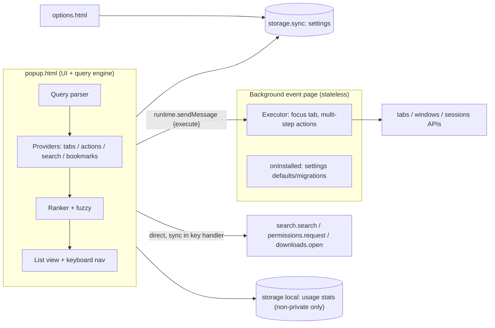

# Konsult — Firefox Launcher Implementation Plan

> **Status:** Active Source of Truth.
> **Legend for verification strength used throughout:**
> - **[V-src]** — MDN source text read directly during reconnaissance.
> - **[V-sum]** — Confirmed via MDN/Mozilla summary.
> - **[UNVERIFIED]** — Prior knowledge or hypothesis; must be tested before relied upon.

---

## 1. Verified findings

| # | Claim | Verdict | Evidence / nuance | Source |
|---|---|---|---|---|
| R1 | No true system-wide hotkey; the launcher works only when Firefox is focused | **Confirmed** [V-sum] | `commands` shortcuts are browser-level, not OS-level. Closest UX: a `commands` shortcut bound to `_execute_action`, which works from **any** Firefox tab, including privileged pages, because the popup is browser chrome. For true global access you'd need an OS tool outside the extension, e.g. an AutoHotkey or PowerToys Keyboard Manager macro that focuses Firefox and sends the shortcut. **Note:** PowerToys Run already owns `Alt+Space`. | [commands key](https://developer.mozilla.org/en-US/docs/Mozilla/Add-ons/WebExtensions/manifest.json/commands) |
| R2 | Popup vs. content-script overlay trade-offs | **Confirmed, with nuances** (see §1a) | Popup max size is **800×600**, a hard limit [V-sum]. Content scripts are blocked on `about:*`, AMO and other Mozilla restricted domains, and the PDF viewer [V-sum]. A content script message to the background **is not a user action** [V-src]. | [Popups](https://developer.mozilla.org/en-US/docs/Mozilla/Add-ons/WebExtensions/user_interface/Popups), [Content scripts](https://developer.mozilla.org/en-US/docs/Mozilla/Add-ons/WebExtensions/Content_scripts), [User actions](https://developer.mozilla.org/en-US/docs/Mozilla/Add-ons/WebExtensions/User_actions) |
| R3 | Extensions can't open privileged `about:` URLs via `tabs.create` | **Confirmed** [V-sum] | Blocked: `chrome:`, `javascript:`, `data:`, `file:`, and privileged `about:` pages (MDN names `about:config`, `about:addons`, `about:debugging`). Allowed: non-privileged `about:` pages (e.g. `about:blank`). `about:newtab` opens when you **omit `url`**. `about:downloads` and `about:preferences` aren't named by MDN but are almost certainly privileged **[UNVERIFIED]**. The M0 probe (§8) will produce the definitive matrix. **Scope impact: high**, see §2 D3 and the @action matrix in §3.4. | [tabs.create](https://developer.mozilla.org/en-US/docs/Mozilla/Add-ons/WebExtensions/API/tabs/create) |
| R4 | `search.search()` with `disposition: NEW_TAB` uses the default engine | **Confirmed** [V-src] | Without `engine` it uses the **default engine**. `disposition` accepts `CURRENT_TAB`, `NEW_TAB`, `NEW_WINDOW`, and defaults to a new tab. It is mutually exclusive with `tabId`. Requires the `"search"` permission. It is Firefox-only. Call it synchronously inside the popup's key handler defensively. | [search.search](https://developer.mozilla.org/en-US/docs/Mozilla/Add-ons/WebExtensions/API/search/search) |
| R5 | Native tab groups API availability | **Confirmed** [V-sum] | `tabs.group()`, `tabs.ungroup()` and `Tab.groupId` arrived in **Fx 138**. The `tabGroups` namespace (`get/query/update/move`) arrived in **Fx 139**. Needs the `"tabGroups"` permission. | [tabGroups](https://developer.mozilla.org/en-US/docs/Mozilla/Add-ons/WebExtensions/API/tabGroups), [tabs.group](https://developer.mozilla.org/en-US/docs/Mozilla/Add-ons/WebExtensions/API/tabs/group) |
| R6 | MV2 vs MV3 on Firefox | **Both supported** [V-sum] | Mozilla has stated it has no plan to deprecate MV2, with ≥12 months' notice if that changes. Firefox MV3 uses **event pages** (`background.scripts`, non-persistent, DOM available), **not** service workers. Recommendation is in §2 D5. | [MV3 migration guide](https://extensionworkshop.com/documentation/develop/manifest-v3-migration-guide/), [background key](https://developer.mozilla.org/en-US/docs/Mozilla/Add-ons/WebExtensions/manifest.json/background) |
| R7 *(new)* | AMO requires a data-collection declaration | **New finding** [V-sum] | Since **2025-11-03**, new AMO submissions need `browser_specific_settings.gecko.data_collection_permissions`. Use `{ "required": ["none"] }`, since we have no telemetry. The key is supported from **Fx 140**. | [Extension Workshop – data consent](https://extensionworkshop.com/documentation/develop/firefox-builtin-data-consent/) |
| R8 *(new)* | User-action context is lost after `await` | **Confirmed** [V-src] | Any `await` before a gated call (`permissions.request`, `downloads.open`, `action.openPopup`, `management.setEnabled`) breaks it. The `commands` shortcut counts as a user action from Fx 63. | [User actions](https://developer.mozilla.org/en-US/docs/Mozilla/Add-ons/WebExtensions/User_actions) |

### 1a. Popup vs. overlay comparison

| Criterion | Browser-action popup (`_execute_action`) | Injected content-script overlay | Extension window (`windows.create({type:"popup"})`) |
|---|---|---|---|
| Works on `about:*`, new tab, AMO, PDF viewer, reader view, `view-source:` | ✅ Yes (browser chrome) | ❌ No | ✅ Yes |
| Size | ≤ 800×600 (hard cap) | Unlimited, can be centered like Spotlight | Unlimited |
| Position | Anchored to toolbar or Unified Extensions button | Centered over the page | OS window; positioning is imprecise |
| Permissions | None extra | `activeTab` + `scripting` (on-demand), or `<all_urls>` (scary warning) | None extra |
| Focus | Input gets focus. Autofocus can be flaky, so call `focus()` after load. The popup auto-closes on blur. | Must fight page focus traps and key handlers. Use shadow DOM for CSS isolation. The page can detect it. | Window switch; visible OS chrome |
| Cold-start | Fresh document each open (~tens of ms with a small bundle) | Injection + messaging each open | Slowest (~100–300 ms) |
| Can call privileged APIs directly | ✅ All `browser.*` APIs | ❌ Must message the background, which loses user-action status [V-src] | ✅ |
| Fullscreen / kiosk | Toolbar hidden, so anchoring is odd — test | ✅ | ✅ |

---

## 2. Open decisions

| ID | Decision | Options | Recommended option and reasoning |
|---|---|---|---|
| **D1** | UI surface | Popup / Overlay / Hybrid | **Popup**. It works on every page, needs zero host permissions, and gives direct API access. 800×600 is plenty for a launcher. Revisit hybrid in M5. |
| **D2** | Action sigil | `@` / `>` / configurable | **`@` for actions, configurable**. When per-engine prefixes ship (M3), engine aliases join the same `@` namespace with explicit precedence: exact action id > exact engine alias > fuzzy. |
| **D3** | Handling `@actions` that target blocked `about:` pages | (a) Hide them (b) Show a "honest fallback" row (c) Replace with an API-based in-launcher view | Mix of **(c)** where an API exists and **(b)** otherwise. Option (b) = copy the URL to the clipboard + toast "Paste into the address bar", and show Firefox's native shortcut as a hint. |
| **D4** | Source-mode prefixes like Firefox's URL bar (`%` tabs, `*` bookmarks, `^` history) | Adopt / custom / none | **Adopt `%` and `*`**. Users already know them, and they're cheap to implement. |
| **D5** | Manifest version | MV2 / MV3 | **MV3**. Future-proof, AMO-friendly, event page background. |
| **D6** | `strict_min_version` | 115 / 128 / 140 / 142 | **142**. Covers `tabGroups` (139) and `data_collection_permissions` (142). User has Firefox 157.0 installed. |
| **D7** | Build tooling | Plain JS ES modules / TypeScript + bundler | **Plain JS + JSDoc + `// @ts-check`**, type-checked by `tsc --noEmit` as devDependency. Zero bundling overhead. |
| **D8** | Fuzzy library | Fuse.js / uFuzzy / vendored fzy-style scorer | **Vendored fzy-style scorer** (MIT, ~150 LOC). Fast, deterministic, matches character highlights. |
| **D9** | Enter behavior when query matches tabs and could be a search | Best match / always search | **Enter = top-ranked row**. Search row floats to top when nothing clears threshold. **Shift+Enter always forces web search**. |
| **D10** | URL-like input (`github.com/foo`) | Search it / navigate to it | **Navigate** (`tabs.create({url})` after normalizing to `https://`), with search row as second option. |
| **D11** | Private browsing | Isolated / mixed | Support when user enables it, **never mix contexts by default**. |
| **D12** | Default shortcut | `Ctrl+Shift+Space` / `Alt+Shift+Space` / letter combos | **`Ctrl+Shift+Space`**. Rebindable via options page / `about:addons`. |
| **D13** | i18n | English only / `_locales` from day 1 | **`_locales/en` and `_locales/id` from day 1**. |

---

## 2a. Decisions Log

| Date | ID | Decision Taken | Rationale / Notes |
|---|---|---|---|
| 2026-10-04 | Naming | Decided project name is "Konsult" ("Kon" = Japanese fox sound こん + "consult" pun) | Confirmed by developer. |
| 2026-10-04 | D1–D13 | Approved recommended options (Popup MV3, Vanilla JS ES Modules + JSDoc, fzy scorer, Ctrl+Shift+Space, min Fx 142, en/id locales) | Confirmed by developer. Provides lowest latency, zero compilation overhead, native browser chrome execution across all tabs. |
| 2026-10-04 | D3 | Honest fallback (clipboard copy + native shortcut hint) + in-launcher UI where API exists | Blocked about: URLs won't fail silently; user gets clear feedback and one-click copy. |
| 2026-10-04 | Publishing | Local / developer profile first, with full AMO compliance (strict permissions, no telemetry declaration, manifest ID) | Ready for AMO submission once stable. |

---

## 3. Architecture



### 3.1 Components
- **Popup** (`popup.html`): owns query → results pipeline. Calls read-only APIs (`tabs.query`, `search.get`, `bookmarks.search`) directly.
- **Background event page (`main.js`):**
  1. `runtime.onInstalled`: write defaults and run schema migrations.
  2. **Executor** for multi-step side effects (`windows.update` → `tabs.update`).
  3. (M5) `commands.onCommand` for hybrid mode, and `omnibox`.
- **Options page (`options.html`):** settings form + shortcut rebinder (`commands.update` / `commands.reset`) + private access notice (`extension.isAllowedIncognitoAccess()`).
- **Core (pure, DOM-free):** `fuzzy`, `ranker`, `ranking-config`, `query-parser`, `url-utils`, `settings-schema`. Unit-testable in Node with `node --test`.

### 3.2 Messaging protocol
```js
// popup -> background
{ type: "execute", action: "focusTab", tabId, windowId }
{ type: "execute", action: "runAction", id: "dedupe", args: {...} }
// background -> popup: Promise resolves { ok: true } | { ok: false, error }
```
**Rule:** user-action-gated calls never go through messaging; they run synchronously in popup handlers before any `await`.

### 3.3 Data flow per feature
- **Web search (F1):** Enter on search row → `browser.search.search({ query, disposition: "NEW_TAB" })` as first statement → `window.close()`. Default engine name and icon from `search.get()`.
- **Tab switcher (F2):** `tabs.query({})` at open → filter private context → build index → fuzzy filter per keystroke → sort (`native` or `alpha`) → optionally group by `hostname`. Select → executor: `windows.update(windowId, {focused:true})` then `tabs.update(tabId, {active:true})`.
- **Actions (F3):** Registry of `{ id, title, keywords, icon, available(ctx), run(ctx), gated: bool, permission? }`.

### 3.4 `@action` feasibility matrix

| Action | Native page | Direct open? | Plan | Extra permission |
|---|---|---|---|---|
| `@downloads` | `about:downloads` | ❌ blocked | In-launcher downloads list (`downloads.search`) + "Open downloads folder" | `downloads` (optional) |
| `@addons` | `about:addons` | ❌ blocked | Fallback: copy URL + shortcut hint | `management` (later, optional) |
| `@settings` | `about:preferences` | ❌ blocked | Fallback (copy + hint). `@options` opens extension options | — |
| `@config`, `@debugging`, `@profiles`, `@support`, `@processes`, `@logins` | privileged | ❌ | Fallback rows only | — |
| `@newtab` | `about:newtab` | ✅ by omitting `url` | `tabs.create({})` | — |
| `@window` / `@private` | — | ✅ / ? | `windows.create({})` / `windows.create({incognito:true})` | — |
| `@reader` | — | ✅ | `tabs.toggleReaderMode()` | — |
| `@print`, `@pdf` | — | ✅ | `tabs.print()`, `tabs.saveAsPDF()` | — |
| `@reload`, `@hardreload`, `@duplicate`, `@pin`, `@mute`, `@close` | — | ✅ | `tabs.reload`, `tabs.duplicate`, `tabs.update`, `tabs.remove` | — |
| `@zoom+/-/0` | — | ✅ | `tabs.setZoom` | — |
| `@restore` | — | ✅ | `sessions.restore` | `sessions` (optional) |
| `@md` | — | ✅ | `navigator.clipboard.writeText("[title](url)")` | — |
| `@shortcuts` | about:addons shortcut UI | ❌ | Open options page section that uses `commands.update` | — |

---

## 4. Manifest (MV3) — permissions

```jsonc
{
  "manifest_version": 3,
  "name": "__MSG_extName__",
  "description": "__MSG_extDescription__",
  "default_locale": "en",
  "action": { "default_popup": "src/popup/popup.html", "default_title": "__MSG_extName__" },
  "commands": { "_execute_action": { "suggested_key": { "default": "Ctrl+Shift+Space" } } },
  "background": { "scripts": ["src/background/main.js"], "type": "module" },
  "options_ui": { "page": "src/options/options.html", "open_in_tab": true },
  "permissions": ["tabs", "search", "storage"],
  "optional_permissions": ["sessions", "bookmarks", "downloads", "tabGroups"],
  "browser_specific_settings": { "gecko": {
    "id": "spotlight@firefox-launcher",
    "strict_min_version": "140.0",
    "data_collection_permissions": { "required": ["none"] }
  }}
}
```

| Permission | Required? | Why | Install warning |
|---|---|---|---|
| `tabs` | Required | Access tab URL, title, favicon, and active state across windows | ⚠️ "Access browser tabs" |
| `search` | Required | Execute search via default engine with `search.search` and get engine info via `search.get` | None |
| `storage` | Required | Save user preferences via `storage.sync` and usage frequency via `storage.local` | None |
| `sessions` | Optional | Restore recently closed tabs (M3) | ⚠️ "Access recently closed tabs" |
| `bookmarks` | Optional | Search bookmarks (M4) | ⚠️ "Read and modify bookmarks" |
| `downloads` | Optional | Search downloads for `@downloads` view | ⚠️ "Download files and read download history" |
| `tabGroups` | Optional | Tab groups manipulation | Tab group warning |

---

## 5. Search and ranking design

**Query parsing:**
- `@dl` → `{ mode: "actions", text: "dl" }`
- `% gith` → `{ mode: "tabs", text: "gith" }`
- `* react` → `{ mode: "bookmarks", text: "react" }`
- `foo bar` → `{ mode: "all", text: "foo bar" }`

**Scorer:**
Vendored fzy-style DP scorer. Match weights: title ×1.0, hostname ×0.9, full URL ×0.6. AND conjunction for multi-tokens.

**Merge formula:**
```
final = fuzzyNorm (0..1)
      × providerWeight      // tabs: 1.0, actions: 1.05 when query matches action, bookmarks: 0.85
      + recencyBonus        // tabs: 0.1 * exp(-(now - lastAccessed)/6h)
      + usageBonus          // actions: 0.05 * log1p(useCount)
      + currentWindowBonus  // 0.03
```
Search row has `THRESH = 0.35` so it floats to the top if no tabs match adequately.

**Keyboard navigation:**
- `↑` / `↓` and `Ctrl+P` / `Ctrl+N`: Navigate rows
- `Enter`: Execute top result
- `Shift+Enter`: Force web search
- `Ctrl+Enter`: Open search in background tab
- `Tab`: Autocomplete action
- `Esc`: Clear input if text present; close popup if input is empty

---

## 6. Settings model

Stored in `storage.sync` under key `"settings"`:
```js
{
  schemaVersion: 1,
  tabs: {
    sortMode: "native",          // "native" | "alpha"
    currentWindowFirst: true,
    groupByDomain: false,
    emptyQueryOrder: "sort",     // "sort" | "mru"
    showPinned: true,
    showDiscarded: true,
    privateMixing: "sameContext" // "sameContext" | "all"
  },
  search: {
    enterBehavior: "topResult",  // "topResult" | "alwaysSearch"
    navigateUrlLike: true,
    foreground: true
  },
  actions: { sigil: "@", disabled: [] },
  ui: { theme: "system", maxResults: 50, showUrls: true, showFavicons: true },
  ranking: { learnFromUsage: true }
}
```

---

## 7. Folder structure

```
FireFox-SpotLight/
├─ manifest.json
├─ _locales/
│  ├─ en/messages.json
│  └─ id/messages.json
├─ icons/
│  ├─ icon-16.png
│  ├─ icon-32.png
│  ├─ icon-48.png
│  └─ icon-96.png
├─ src/
│  ├─ background/main.js
│  ├─ popup/
│  │  ├─ popup.html
│  │  ├─ popup.css
│  │  ├─ popup.js
│  │  ├─ list-view.js
│  │  └─ keyboard.js
│  ├─ options/
│  │  ├─ options.html
│  │  ├─ options.css
│  │  └─ options.js
│  ├─ core/
│  │  ├─ fuzzy.js
│  │  ├─ ranker.js
│  │  ├─ ranking-config.js
│  │  ├─ query-parser.js
│  │  └─ url-utils.js
│  ├─ providers/
│  │  ├─ tabs.js
│  │  ├─ search.js
│  │  ├─ actions.js
│  │  └─ base.js
│  ├─ actions/
│  │  ├─ registry.js
│  │  └─ builtin/
│  ├─ settings/
│  │  ├─ schema.js
│  │  ├─ store.js
│  │  └─ migrations.js
│  ├─ shared/
│  │  ├─ messages.js
│  │  └─ private-context.js
│  └─ vendor/
│     ├─ fzy.js
│     └─ LICENSE-fzy
├─ tests/
│  ├─ unit/
│  │  ├─ fuzzy.test.js
│  │  ├─ ranker.test.js
│  │  ├─ query-parser.test.js
│  │  ├─ url-utils.test.js
│  │  └─ settings.test.js
│  └─ manual/
│     └─ checklist.md
├─ tools/
│  └─ probe-about-urls.js
├─ jsconfig.json
├─ web-ext-config.mjs
├─ package.json
└─ docs/
   ├─ IMPLEMENTATION_PLAN.md
   └─ about-matrix.md
```

---

## 8. Milestones

### M0 — Spike and Scaffolding [COMPLETED]
- [x] Scaffold manifest (MV3), empty popup, icons (16/32/48/96/128), background event page, and options page.
- [x] Run `web-ext lint` and ensure clean output (**0 errors, 0 warnings, 0 notices**).
- [x] Implement `tools/probe-about-urls.js` dev spike to test `tabs.create` against all `about:*` URLs and output `docs/about-matrix.md`.
- [x] Test shortcut binding (`Ctrl+Shift+Space`), autofocus, and executor messaging.
- [x] Record decisions D1–D13 into Decisions Log.

### M1 — MVP: Web Search + Tab Switcher [COMPLETED]
- [x] Web search provider with default engine prefetching via `browser.search.get()`.
- [x] Synchronous search dispatch via `browser.search.search({ query, disposition: "NEW_TAB" })`.
- [x] Tab provider listing all open tabs across windows via `browser.tabs.query({})`.
- [x] Sorting: `native` tab order vs `alpha` (Intl.Collator).
- [x] UI-level domain grouping (skip group headers with keyboard).
- [x] Keyboard navigation (arrows, Ctrl+N/P, Enter, Shift+Enter, Esc).
- [x] Options page to configure sortMode, grouping, and maxResults.
- [x] Performance budget: zero compilation overhead, DocumentFragment rendering, instant query response.
- [x] 17 unit tests passing with 100% pass rate (`npm test`).
- [x] Manual testing checklist documented at `tests/manual/checklist.md`.

### M2 — `@actions` (F3)
- Action registry and query mode (`@`).
- Builtin actions: `@newtab`, `@window`, `@reload`, `@duplicate`, `@pin`, `@mute`, `@close`, `@reader`, `@zoom`.
- Blocked target fallbacks (`@addons`, `@settings`, `@config`): copy URL + show native shortcut.
- Optional permission handling for `@downloads`.

### M3 — Quick wins (v1.x)
- Tab row action buttons (pin, mute, close).
- `@md` (copy as markdown link).
- Recently closed tabs (`sessions` API).
- Search engine aliases (`search.get()`).

### M4 — v2
- Bookmarks search (`*`).
- Dedupe tabs & close same domain tabs.
- Discard tabs to free RAM.
- Native tab groups integration (`tabGroups` API).

### M5 — Later
- Hybrid overlay option.
- Omnibox keyword launcher.
- History search.
